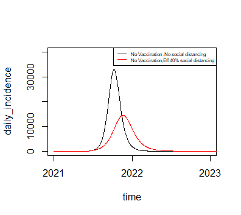
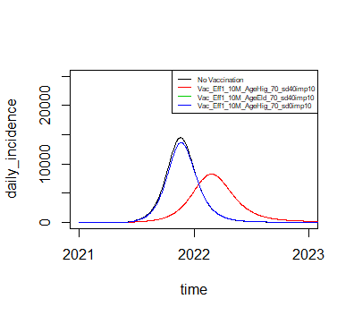
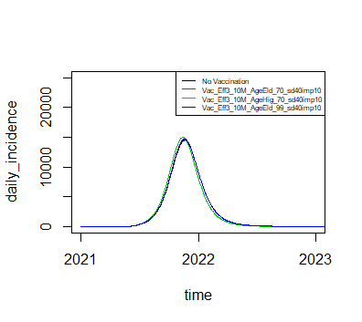

# CoVac19TH
COVID19 Vaccine Modelling for Thailand

### https://www.researchsquare.com/article/rs-270635/v1

# Optimal vaccine strategy to control COVID-19 pandemic in middle-income countries: Modelling case study of Thailand
# Abstract
Thailand is facing the dilemma of which groups to prioritise for the limited first tranche of vaccinations in 2021. A mathematical modelling analysis was performed to compare the potential short-term impact of allocating the available doses to either the high-risk group (over 65-year-olds) or the high incidence group (aged 20-39). Vaccinating the high incidence group with a vaccine with sufficiently high protection against infection (more than 50%) could provide enough herd effects to delay the expected epidemic peak, resulting in fewer deaths within the 12-month time horizon compared to vaccinating the same number of the high-risk group. After 12 months, if no further vaccination or other interventions were deployed, this strategy would lead to more deaths. With the right vaccine efficacy profile, targeting the high incidence groups could be a viable short-term component of the Thai vaccination strategy. These results and emerging evidence on vaccines and susceptibility suggest prioritisation guidelines should be more nuanced.
# Usage
Using function VacTPP_all_scens_4() for results

```r
VacTPP_all_scens_4 <- function(par1, par2, par3, par4, par5, par6, par7, par8, par9){
  AgeVac<<-par1  #AgeAll, AgeAdult, AgeHighI, AgeElder
  parameters["vaccine_cov"] <- par2
  parameters["vaccine_eff1"] <- par3
  parameters["vaccine_eff2"] <- par4 #reduce viral shredding 0, 0.5,0.7
  parameters["vaccine_eff3"] <- par5 # reduce severity 0, 0.5,0.7
  parameters["omegav"]<- 1/(par6*365) # vaccine duration 0.5, 1
  parameters["omega"]<- 1/(par7*365)   # average duration of immunity (years) min 0.5 max 100 step 0.5  (default 200)
  parameters["dist_eff"]<-par8    # adherence to social distancing (%) min 0 max 100 step 1 , (0, 0.2, 0.4)
  parameters["mean_imports"]<-par9 #0,10,100
  out.vaceff_2 <- ode(y = Y, times = times, func = covid, parms = parameters)
  results.vaceff_2 <- process_ode_outcome_1yr(out.vaceff_2)
  return(results.vaceff_2)
}
```
### Example
```r
#Example
#No vac
Baseline_w_sd_0_imp10<-VacTPP_all_scens_4(NoVac,0,0,0,0,1,2,0,4.8) #No vac ,no social distancing
Baseline_w_sd_40_imp10<-VacTPP_all_scens_4(NoVac,0,0,0,0,1,2,0.4,4.8) #No vac ,Eff 40% social distancing
#Vac Eff1
Vac_Eff1_10M_AgeHig_70_sd40imp10<-VacTPP_all_scens_4(AgeHighI,0.52163,0.7,0,0,1,2,0.4,4.8)
Vac_Eff1_10M_AgeEld_70_sd40imp10<-VacTPP_all_scens_4(AgeElder,0.92172,0.7,0,0,1,2,0.4,4.8)
Vac_Eff1_10M_AgeHig_70_sd0imp10<-VacTPP_all_scens_4(AgeHighI,0.52163,0.7,0,0,1,2,0,4.8)
#Vac Eff3
Vac_Eff3_10M_AgeEld_99_sd40imp10<-VacTPP_all_scens_4(AgeElder,0.92172,0,0,0.999,1,2,0.4,4.8)
Vac_Eff3_10M_AgeEld_70_sd40imp10<-VacTPP_all_scens_4(AgeElder,0.92172,0,0,0.7,1,2,0.4,4.8)
Vac_Eff3_10M_AgeHig_70_sd40imp10<-VacTPP_all_scens_4(AgeHighI,0.52163,0,0,0.7,1,2,0.4,4.8)
```
### Plot 
```r
plot(Baseline_w_sd_0_imp10[["time"]],Baseline_w_sd_0_imp10[["daily_incidence"]],xlab="time",ylab="daily_incidence",type="l", col="1",xlim = as.Date(c("2021-01-01","2023-01-01")),ylim =c(0,40000))
lines(Baseline_w_sd_40_imp10[["time"]], Baseline_w_sd_40_imp10[["daily_incidence"]], col="2")
legend("topright", legend=c("No Vaccination ,No social distancing", "No Vaccination,Eff 40% social distancing"),
       col=c("1", "2"), lty=1,cex = 0.5)
```



```r
plot(Baseline_w_sd_40_imp10[["time"]],Baseline_w_sd_40_imp10[["daily_incidence"]],xlab="time",ylab="daily_incidence",type="l", col="1",xlim = as.Date(c("2021-01-01","2023-01-01")),ylim =c(0,25000))
lines(Vac_Eff1_10M_AgeHig_70_sd40imp10[["time"]], Vac_Eff1_10M_AgeHig_70_sd40imp10[["daily_incidence"]], col="2")
lines(Vac_Eff1_10M_AgeEld_70_sd40imp10[["time"]], Vac_Eff1_10M_AgeEld_70_sd40imp10[["daily_incidence"]], col="3")
lines(Vac_Eff1_10M_AgeHig_70_sd0imp10[["time"]], Vac_Eff1_10M_AgeEld_70_sd40imp10[["daily_incidence"]], col="4")
legend("topright", legend=c("No Vaccination", "Vac_Eff1_10M_AgeHig_70_sd40imp10","Vac_Eff1_10M_AgeEld_70_sd40imp10","Vac_Eff1_10M_AgeHig_70_sd0imp10"),
       col=c("1", "2","3","4"), lty=1,cex = 0.5)

```



```r
plot(Baseline_w_sd_40_imp10[["time"]], Baseline_w_sd_40_imp10[["daily_incidence"]], col="1",xlab="time",ylab="daily_incidence",type="l",xlim = as.Date(c("2021-01-01","2023-01-01")),ylim = c(0,25000))
lines(Vac_Eff3_10M_AgeEld_70_sd40imp10[["time"]], Vac_Eff3_10M_AgeEld_70_sd40imp10[["daily_incidence"]], col="2")
lines(Vac_Eff3_10M_AgeHig_70_sd40imp10[["time"]], Vac_Eff3_10M_AgeHig_70_sd40imp10[["daily_incidence"]], col="3")
lines(Vac_Eff3_10M_AgeEld_99_sd40imp10[["time"]], Vac_Eff3_10M_AgeEld_99_sd40imp10[["daily_incidence"]], col="4")
legend("topright", legend=c("No Vaccination", "Vac_Eff3_10M_AgeEld_70_sd40imp10","Vac_Eff3_10M_AgeHig_70_sd40imp10","Vac_Eff3_10M_AgeEld_99_sd40imp10"),
       col=c("1", "2","3","4"), lty=1,cex = 0.5)
```


